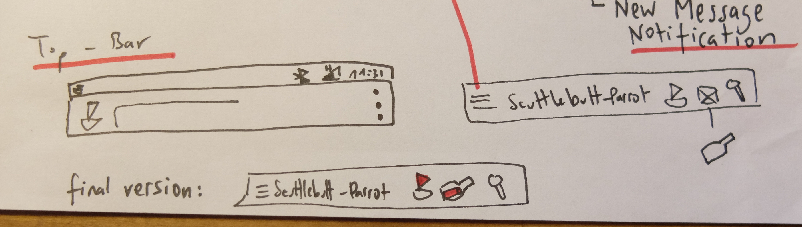
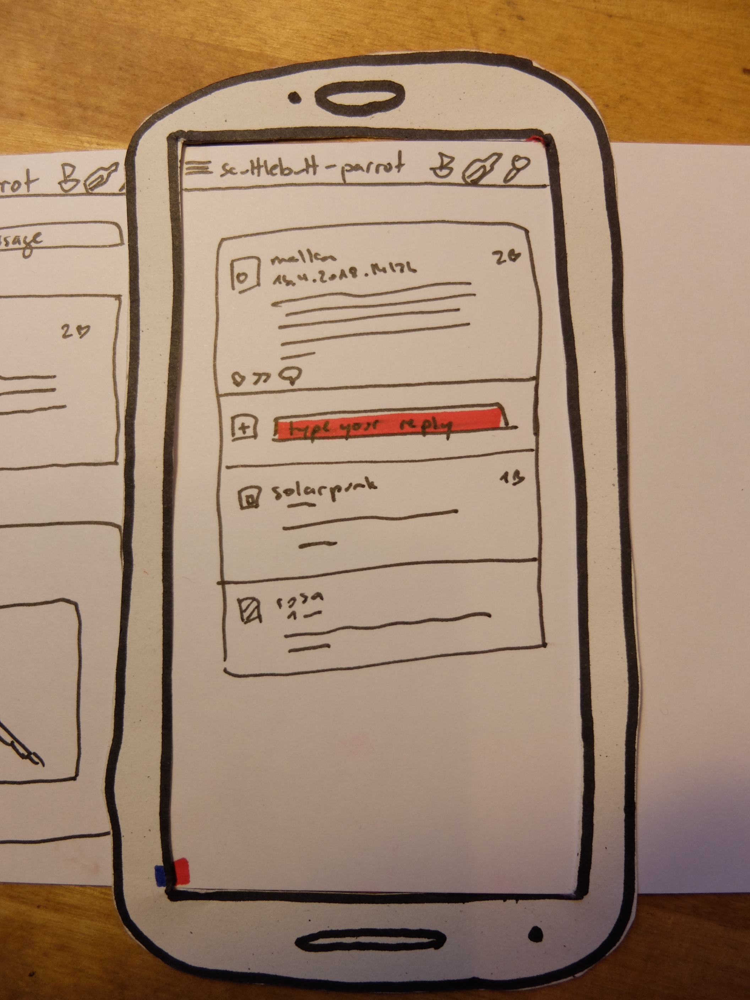

# Design Report

## Interviews
In the beginning of the design process wen conducted interviews with potential users of our software. The interviews were recorded and the transcribed. Following highest standard procedures in data security, all recordings are anonymised and given a pseudonym.

### Interview Questions

#### 1 what are the key point you would value of a social network or this application
#### 2 key aspects of the networks ?
#### 3 how important is data security for you?
#### 4 what do you expect from a network?
#### 5 which experience could cloud the mood?
#### 6 which experience you want never to happen?
#### 7 what are the important aspects of interaction for you?
#### 8 what kind of usabilty you as a user do you expect?
#### 9 What are the key elements for you on a social network site?
#### 10 are there any elements you miss at most of the sites you use?
#### 11 do you have sometime the feeling there are to many elements on your
#### favorite social network
#### 12 have you ever experienced some kind of emotions you would descripe as
#### positive while using a social network?
#### 13 have you ever experienced some kind of emotions you would descripe as
#### negative while using a social network?
#### 14 how long does it take for you until who stop using a site?
#### 15 how important for you are new features?
#### 16 in which interval you expect from an page an introduction of new features?
#### 17 Would you descripe yourself as an early adapter?
#### 18 How long does it take for you to comfortable with an social network?
#### 19 How much time do you spend on social networks in average.
#### 20 Have you ever submitted a bug to any site?

## Personas
From the interviews and our initial peer group analysis we concluded personas.

## 1 Alex
Age: 15
experience: newbie
Internet usage: right after school up to 4 a day.
usage of Social networks: instagram, facebook, whatsapp
Description: Student of middle school and therefore
she goes along with all the new stuff the other kids have as
well. Don't want to be overviewed by authorities and stay in contact with her friends.

## 2 Ali
Age:  35
experience: average user
Internet usage: besides work up to 3 hours a day
usage of Social networks: whatsapp, facebook
Description: uses all the app from the social networks only if an big amount of friends or family have it. he wants to stay private and want to have data security although he has no real understanding about the deeper layers about that.

## 3 Didie
Age: 40
experience: average user
Internet usage: from 6 to 8 a days.
usage of Social networks: all the big networks
Description: can use his phone while his work. So he wants to stay in contact mainly with his social group and share jokes and stories. There is no hesitation of changing the new work if the social groups does it as well.

## 4 Marie
Age: 38
experience: experienced user
Internet usage: with work 10 hours a day
usage of Social networks: only whatsapp
Description: Has a deeper understanding of all the data security and privacy issues of those networks. Values privacy. But also wants to stay in contact with his close family. Searches for flaws in new networks.

## 5 Micha B.
Age: 45
experience: newbie but heavy users.
Internet usage: 8
usage of Social networks: whatsapp, facebook
Description: has absolutely no technical understanding but is wants to play along with his friends and colleagues and share jokes and stories. The attention management of the apps effects him strongly. He does not care about privacy or data security and wants to have the as simple as possible.

## Design 0: Logo

## Design 1: Structure
First we designed the structural elements (such as menus, notifications, icons) of the app.
### Window

### Top-Bar

### Notifications

### Menus
#### Left Navigation Drawer

#### Help Menu

### Content

### Post

### Post Actions

## Design 3: Paper Prototype (Low Fidelity Prototype)
Our prototype is a paper frame of a smartphone. To simulate the app you insert a paper strip into the frame and slide it to the left. The different screens of the workflows and interactions will appear in the right order.
There is little markers (red dots) on the bottom of the strip indicating the correct position of a given screen. Actions are highlighted in red.
### Workflows and Interactions
#### 1. Connecting to Network (Node)

#### 2. Show Thread / Look at Channel

#### 3. Private Feed Message

#### 4. Search

#### 5. View Thread and Reply (Public Message)

